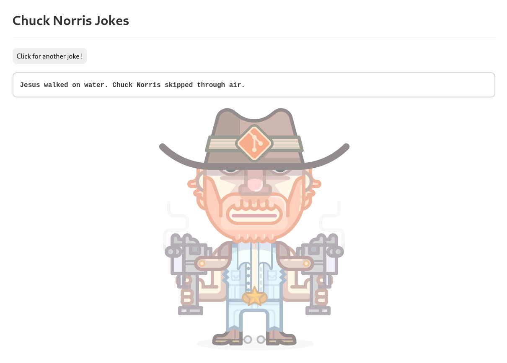

 

# Chuck Norris Joke

Réalisé dans le cadre d'un exercice de la Wild Code School. 

Ce script en JavaScript exploite une API qui affiche une phrase aléatoire de Chuck Norris.

Un aperçu ici : https://geraldb69.github.io/Chuck-Norris-Joke/
